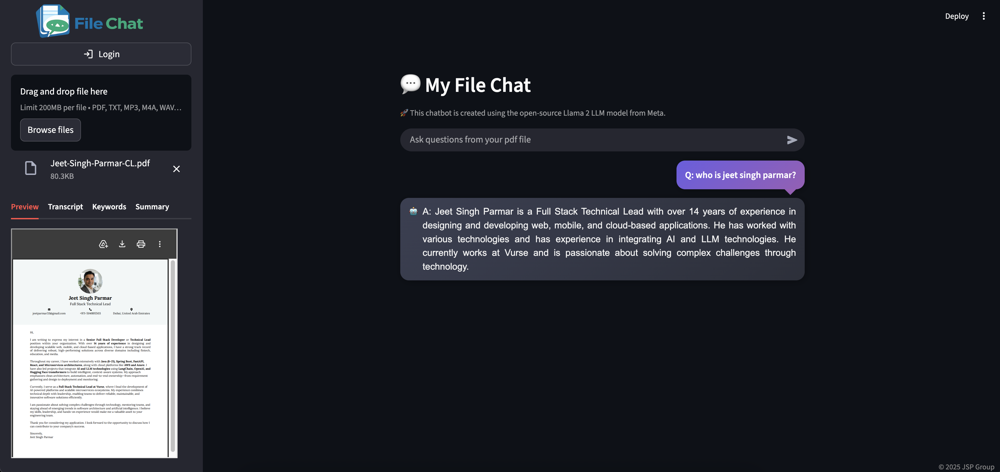

# 💬 My File Chat

<div align="center">
    
    <h3>Talk to Your Data, Any Format, Any Time.</h3>
    <p>A powerful AI chatbot designed to interact with your documents, images, audio, and video files.</p>
</div>

---

## 🚀 Overview

**My File Chat** is a versatile AI-powered assistant that allows you to upload various file types and chat with them directly. Whether it's a PDF report, a TXT file, a recorded meeting (audio), a demo video, or even an image containing text, this app uses state-of-the-art LLMs and OCR technology to extract insights and answer your questions.

## ✨ Key Features

-   **Multi-Format Processing**: Supports `.pdf`, `.txt`, `.mp3`, `.m4a`, `.wav`, `.mp4`, `.png`, `.jpg`, `.jpeg`.
-   **OCR Capabilities**: Extract text from images using Tesseract OCR.
-   **Media Transcription**: Transcribe audio and video files using FFmpeg and SpeechRecognition.
-   **Intelligent Chat**: Context-aware conversations powered by OpenAI and LangChain.
-   **Automatic Summarization**: Instantly generate concise summaries of long documents or transcripts.
-   **Keyword Extraction**: Identify key topics and themes within your files.
-   **Persistent History**: Save your conversations and insights to MongoDB for future reference.
-   **Modern UI**: Sleek, responsive interface built with Streamlit.

## 🛠️ Tech Stack

-   **Frontend**: [Streamlit](https://streamlit.io/)
-   **Orchestration**: [LangChain](https://www.langchain.com/)
-   **LLM**: [OpenAI GPT-4o](https://openai.com/)
-   **Vector Store**: [FAISS](https://github.com/facebookresearch/faiss)
-   **Database**: [MongoDB](https://www.mongodb.com/)
-   **OCR**: [Tesseract OCR](https://github.com/tesseract-ocr/tesseract)
-   **Transcription**: [FFmpeg](https://ffmpeg.org/), [MoviePy](https://zulko.github.io/moviepy/), [SpeechRecognition](https://pypi.org/project/SpeechRecognition/)

---

## ⚙️ Installation & Setup

### 1. Prerequisites

Ensure you have the following system dependencies installed:
-   **Python 3.9+**
-   **Tesseract OCR**
-   **FFmpeg**

### 2. Clone & Prepare Environment

```bash
# Clone the repository
git clone https://github.com/jeetparmar/my-file-chat.git
cd my-file-chat

# Create a virtual environment
python3 -m venv .venv
source .venv/bin/activate  # On Windows use `.venv\Scripts\activate`

# Install dependencies
pip install --upgrade pip
pip install -r requirements.txt
```

### 3. Configuration

Create a `.env` file in the root directory and add your API keys:

```env
OPENAI_API_KEY=your_openai_api_key_here
MONGODB_CONNECTION_STRING=your_mongodb_uri_here
```

---

## 🚀 Running the App

### Locally
```bash
streamlit run app.py
```

### via Docker
```bash
# Build the image
docker build -t my-file-chat .

# Run the container
docker run -p 8501:8501 my-file-chat
```

---

## 📸 Demo Screenshots

<div align="center">
    <div style="display: grid; grid-template-columns: repeat(2, 1fr); gap: 20px; margin: 20px 0;">
        
        
    </div>
</div>

---

## 📄 License

&copy; 2026 JSP Group. All rights reserved.
